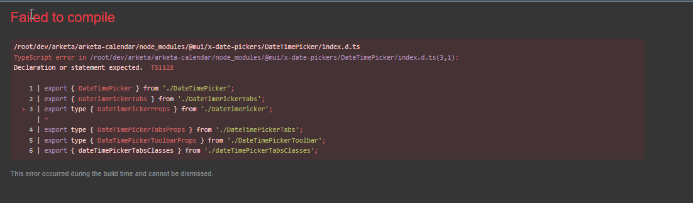
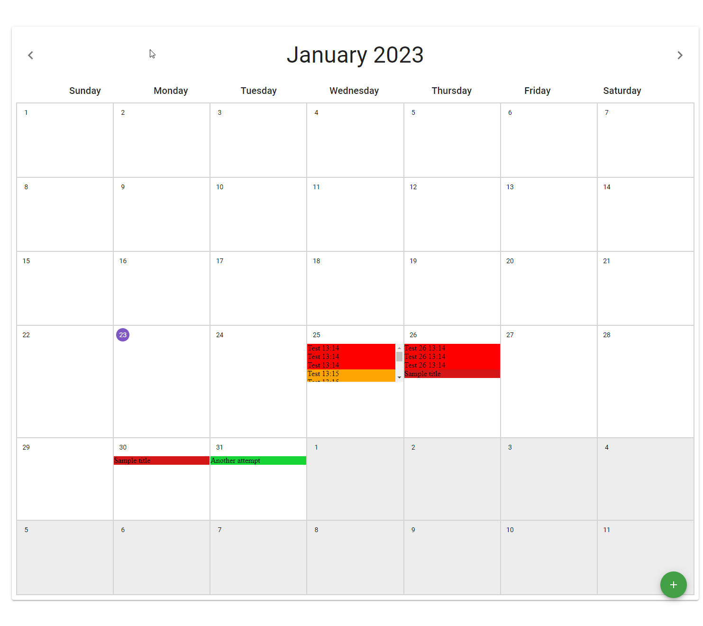
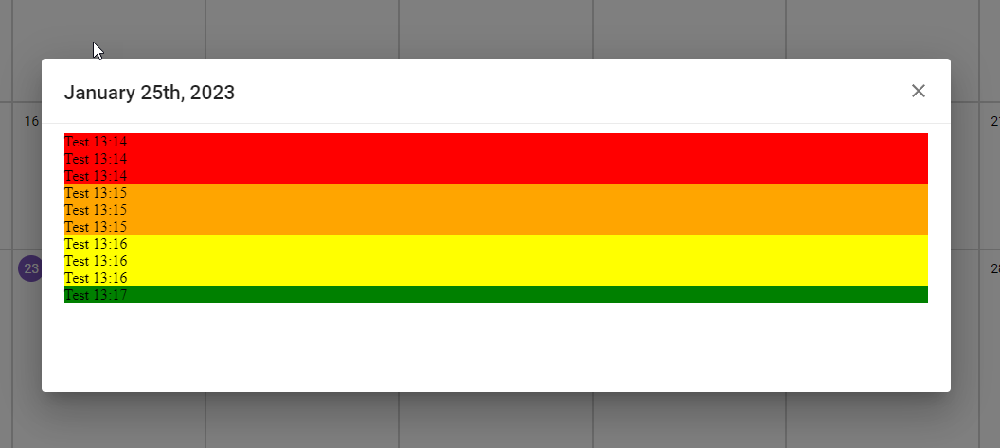

# Dev Journal

### 5:21am - 1/23/2023

Old CRA is broken for WSL2. I fixed it with suggestions from [this thread](https://github.com/facebook/create-react-app/issues/7251).

I'm running `yarn dev` instead of `yarn start` to use the patch.

### 5:33am

Installed `@mui/x-date-pickers` and added my standard `.prettierrc` file to stop VSCode complaints.

### 5:37am

Turns out that `@mui/x-date-pickers` isn't compatible with this project???

Switching to `type="datetime-local"`

### 5:42am

This project uses old MUI. I've got to find the old docs.

Here it is: https://v3.mui.com/

### 6:17am

Finally got the reducer figured out. It's been ages since I've used Redux.

### 6:20am

Fighting with Redux boilerplate and TS.

### 6:54am

I hate CRA so much. It was screwing up the HMR. I just had to restart it. I blew 30min on CRA's inability to HMR correctly.

## 7:19am

Added `overflow: auto`. I could remove the scrollbar if this weren't ancient MUI. I'm not excited about researching and learning old MUI patterns.

## 8:02am

Got `localforage` saving working. Calling it.

